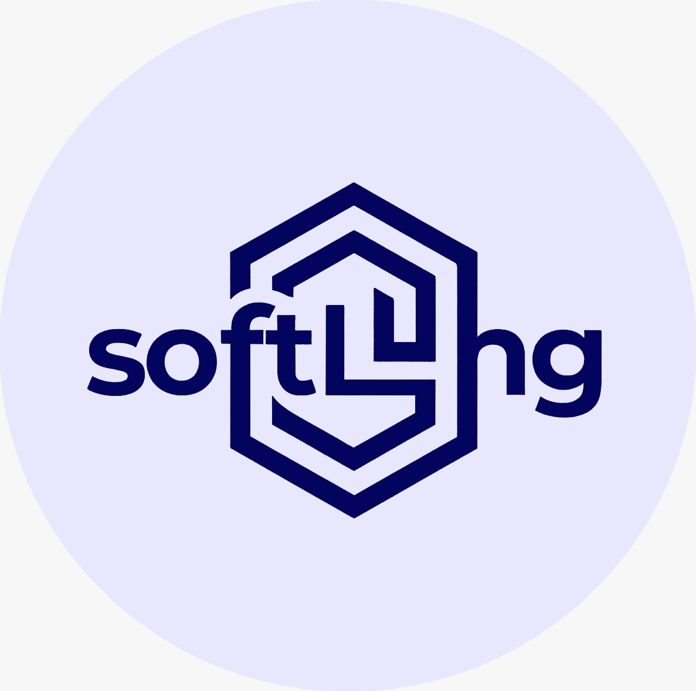
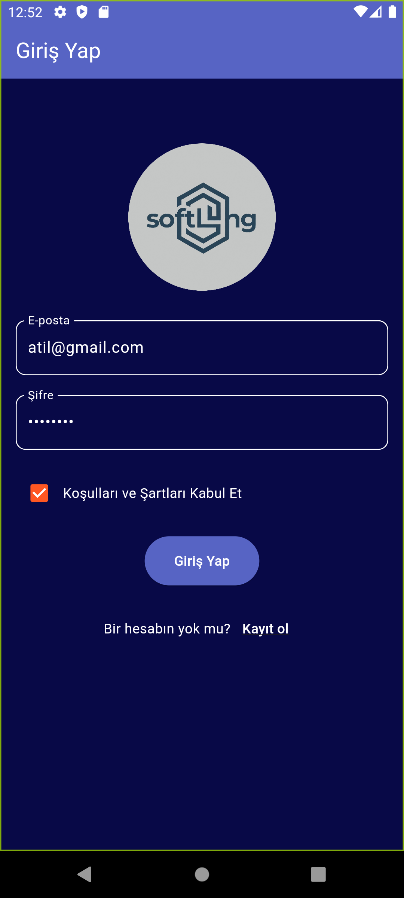
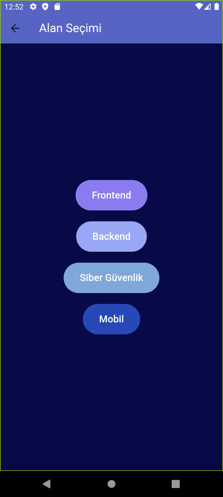
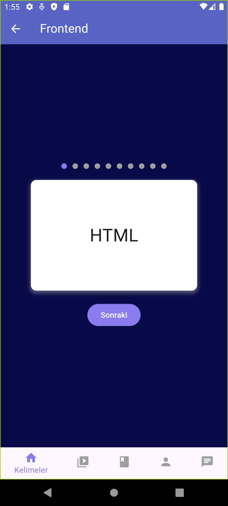
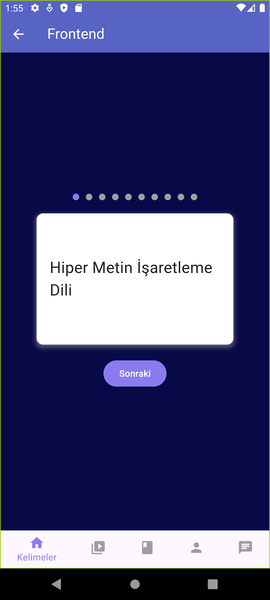
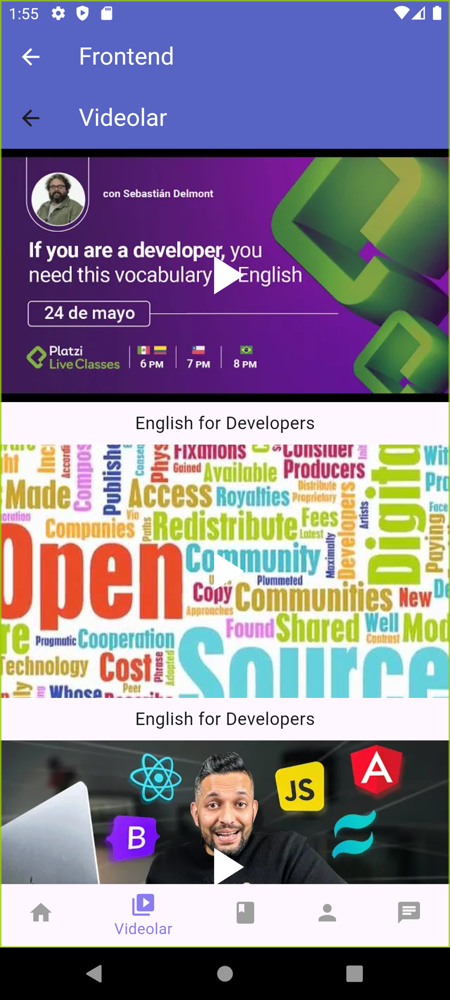
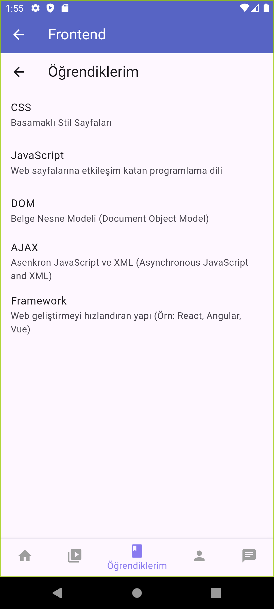
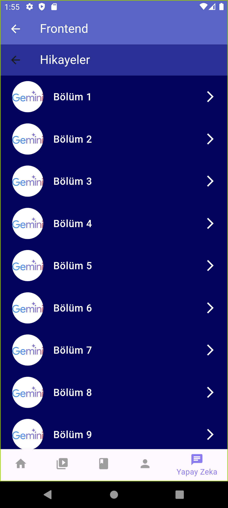
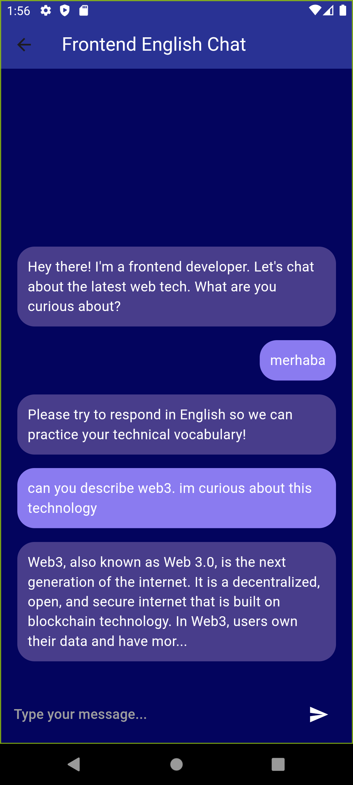

<p align="center">
  
</p>

logo gelecek

# Softlang(Software Language Learning)
- [Giriş](#Giriş)
- [Özellikler](#Özellikler)
- [Ekran Görüntüleri](#screenshots)
- [Kurulum](#Kurulum)
- [Kütüphaneler](#Kütüphaneler)
- [Takım Üyeleri](#TakımÜyeleri)
 ## Yazılımcılar İçin İngilizce Dil Öğrenme 


Hoş geldiniz, yazılımcı adayları ve yazılım profesyonelleri! Softlang, sadece bir dil öğrenme uygulaması değil, yapay zekayla çalışan chatbot sayesinde speaking yeteneklerinizi geliştirmenize yardımcı olacak özel bir platformdur.

# Kodlamanın Dili: İngilizce
Yazılım dünyasında ilerlemek için, sadece kod yazmayı öğrenmek yeterli değil. İngilizce, dünyanın dört bir yanındaki yazılım geliştiricileriyle iletişim kurmanın anahtarıdır. CodeSpeak, bu iki önemli beceriyi bir araya getirerek size yazılımın dilini öğrenme fırsatı sunar.


## Özellikler

 * 1- Kelime Kartları :
    Dil öğrenme deneyimini kodlama kavramlarıyla birleştirir. Her bir kart size bir İngilizce kelime veya ifade öğretirken, aynı zamanda yazılım geliştirme ile ilgili temel kavramları da keşfetmenizi sağlar. 

* 2- Öğrendiğim Kelimeler : 
    Ne kadar kart çevirip anlamını öğrenirseniz, öğrendiğiniz kelimelerin hepsini öğrenilenler sayfasında bulabilir ve tekrar edebilirsiniz.

* 3- Videolar :
    Uygulama içinde günlük olarak güncellenen seçtiğiniz yazılım alanında bilgi verici yerleşik videolar

* **4- Hikayeler(yapay zekalı bölüm):**
    içerisinde farklı bölümler olan hikayeler kısmı sayesinde yapay zekayla birebir speaking alıştırması yapabilir ve öğrendiklerinizi uygulayabilirsiniz.(gemini api'yle çalışmaktadır)

## Ekran Görüntüleri


<p align="center">
  
  
  
  
  
  
  
  
</p>

## Kurulum

### 1. Depoyu klonlayın:

``` https://github.com/furkanava/softlang-app.git ```

### Uygulamayı çalıştırın:

``` cd softlang-app install npm start ```
## Kütüphaneler

* flip_card: ^0.7.0
* youtube_player_flutter: ^9.0.1
* http: ^1.2.1
* flutter_gemini: ^2.0.3
* sdk: ">=2.12.0 <3.0.0"

## Takım Üyeleri
 Erdem Dayan [@eridiemmm2525](https://github.com/eridiemmm2525) kodlama

Furkan Kül [@furkanava](https://github.com/furkanava) kodlama

Kinda Muhyeddin [@KindaMhd](https://github.com/KindaMhd) figma ui tasarım

Sema Erakbıyık [@serakbiyik](https://github.com/serakbiyik) figma ui tasarım


